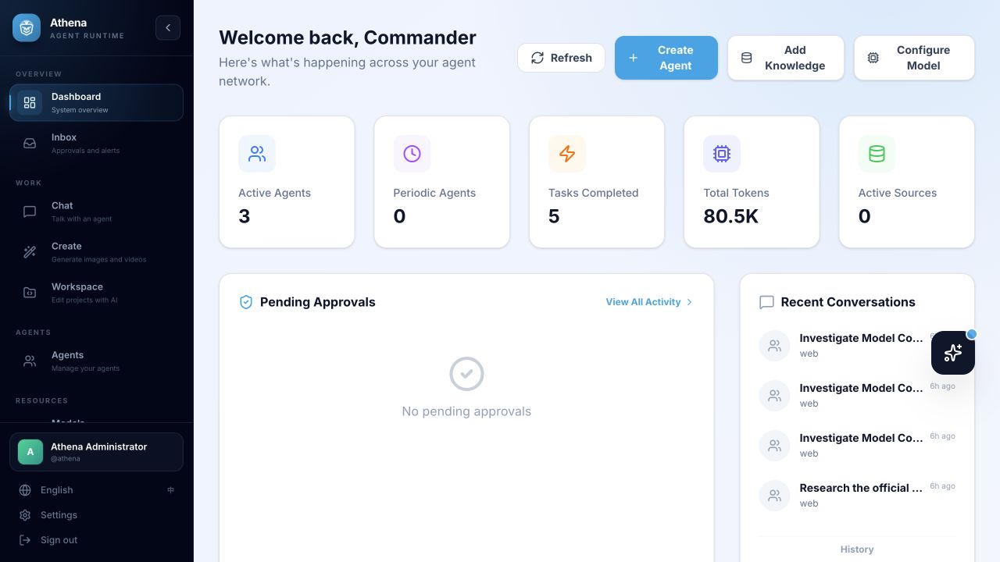
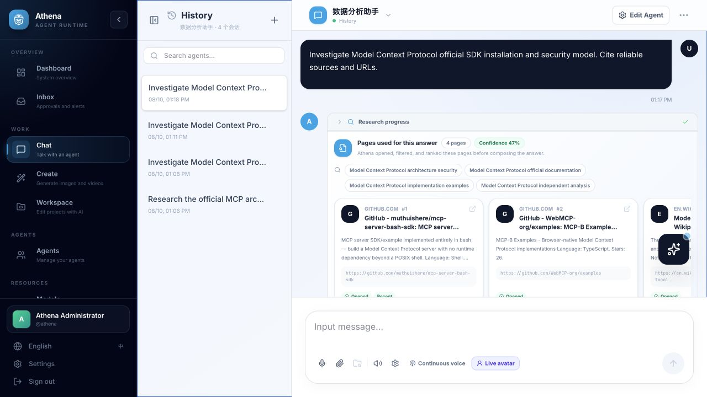
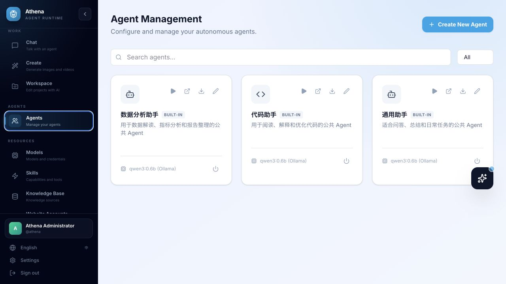
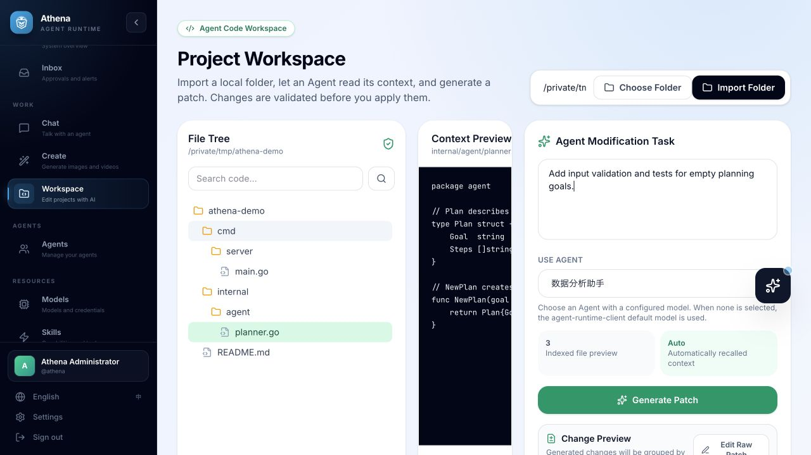
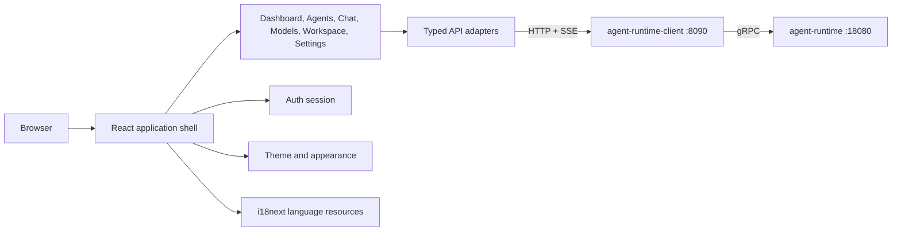

# Athena Agent UI

[English](README.md) | [简体中文](README.zh-CN.md)

Athena Agent UI is the browser interface for the Athena agent platform. It connects to [`agent-runtime-client`](https://github.com/good-fish-man/agent-runtime-client) and provides agent creation, model management, chat, project editing, knowledge, skills, voice interaction, monitoring, and service configuration in one application.

<p align="center">
  
</p>
<p align="center"><sub>A live, API-backed dashboard from a running local Athena stack.</sub></p>

## Highlights

- User registration/login, profile, avatar, and administrator-aware views.
- Dashboard for agents, task/token activity, conversations, and approvals.
- Agent builder with LLM, embedding, image model, skill, tool, knowledge, memory, sandbox, and sub-agent settings.
- Agent-scoped chat history with streaming text, tool events, generated media, approvals, and voice input/output.
- Model key vault, cloud/local model creation, local downloads, lifecycle controls, fine-tuning, and distillation.
- Website Accounts with encrypted agent-browser Auth Vault storage and domain-aware assisted sign-in cards in chat.
- Inbox management for chat-created ticket, stock, and appointment monitors with pause/resume and interactive result review.
- Project workspace import, file tree/search, natural-language optimization, patch preview, per-file diff, and patch application.
- Skills, knowledge bases, channels, inbox, and command center.
- Client, Runtime, and Skills configuration with status checks and controlled service restart.
- User-selectable language, theme color, page background, and card surfaces.
- Responsive desktop and mobile layouts.

## Product Tour

These screenshots were captured from a running Athena stack rather than static mockups. Agent names, conversations, and counters are sample data, while the views and API-backed states are the same ones used by the application.

### Evidence-first research

Athena exposes the research plan instead of hiding it behind a spinner: users can see the generated queries, ranked pages, source URLs, evidence scores, and the final cited response.



### Configure agents and work on code

| Agent management | Project workspace |
| --- | --- |
| Create and bind reusable agents without exposing provider keys to the browser. | Import a directory, inspect context, describe a project-level change, and review the patch before applying it. |
|  |  |

## Architecture



| Area | Location |
| --- | --- |
| Application shell and navigation | `src/App.tsx`, `src/components/Sidebar.tsx` |
| Feature views | `src/components/` |
| API mapping and SSE | `src/lib/api.ts` |
| Authentication | `src/lib/auth.ts`, `src/components/AuthScreen.tsx` |
| Internationalization | `src/i18n.ts` |
| Theme persistence | `src/lib/theme.ts` |
| Shared domain types | `src/types.ts` |

## Requirements

- Node.js 20 or newer.
- npm 10 or newer.
- A running Agent Runtime Client, normally at `http://localhost:8090`.
- Agent Runtime and PostgreSQL behind the client for complete functionality.

For non-developers, install the complete stack using [`athena-launcher`](https://github.com/good-fish-man/athena-launcher).

## Quick Start

```bash
git clone https://github.com/good-fish-man/athena-agent-ui.git
cd athena-agent-ui
npm install
cp .env.example .env.local
npm run dev
```

Open [http://localhost:3000](http://localhost:3000).

The default development administrator created by the backend is `athena` / `athena`. It is initialized only when absent, so restarting does not reset a changed password. Replace it outside a trusted local development environment.

Do not open `index.html` with a `file://` URL. Vite builds use ES modules and browser routing, so the application must be served over HTTP using `npm run dev`, `npm run preview`, Nginx, or Athena Launcher.

## Environment

`.env.example` contains the supported frontend settings:

```dotenv
VITE_AGENT_RUNTIME_CLIENT_URL="http://localhost:8090"
VITE_AGENT_RUNTIME_PUBLIC_PREFIX="/api/agent-runtime-client/v1"
VITE_AGENT_RUNTIME_API_PREFIX="/v1"
```

| Variable | Purpose |
| --- | --- |
| `VITE_AGENT_RUNTIME_CLIENT_URL` | Agent Runtime Client origin |
| `VITE_AGENT_RUNTIME_PUBLIC_PREFIX` | Authenticated management API prefix |
| `VITE_AGENT_RUNTIME_API_PREFIX` | Runtime execution API prefix |
| `GEMINI_API_KEY` | Optional Google AI Studio integration; not required for normal backend-driven models |

Model provider keys should be entered through Models > Model Keys. They are stored by the backend and are not returned to the browser in agent/model list responses.

## User Guide

### First Run

1. Register or sign in.
2. Open **Models** and add a model key, unless the selected local provider does not require one.
3. Create a model from the catalog or download a supported free local model.
4. Open **Agents**, create an agent, and explicitly bind its LLM/embedding/image models.
5. Open **Chat**, select the agent, and start a conversation.

If an agent has no model binding, the client attempts to use the current user's default LLM. Public agents always use the current user's model credentials.

### Project Workspace

1. Open **Workspace** and choose or enter a project directory.
2. Import the workspace and inspect the file tree.
3. Describe a project-level change; selecting a single file is optional.
4. Generate a patch, inspect additions/deletions per file, validate it, then apply it.

Workspace operations execute on the machine running `agent-runtime-client`. Do not expose local-directory APIs to untrusted networks.

### Appearance and Language

Open **Settings** to switch Chinese/English and customize primary, page background, and card colors. Preferences are applied globally and saved in the browser.

## Development

```bash
npm run dev       # Vite development server on port 3000
npm run lint      # TypeScript type check
npm run build     # Production build in dist/
npm run preview   # Preview the production build
```

Use `npm ci` instead of `npm install` in CI to honor `package-lock.json` exactly.

## Container Build

```bash
docker build -t athena-agent-ui .
docker run --rm -p 3000:3000 athena-agent-ui
```

The image serves `dist/` with Nginx. Ensure the browser can reach the configured Agent Runtime Client origin, or adapt the Nginx `/api` proxy for your deployment.

## Troubleshooting

- Blank page from a local file: serve the app over HTTP; do not use `file://`.
- Login/network failure: verify port `8090`, `VITE_AGENT_RUNTIME_CLIENT_URL`, CORS, and client health.
- Chat reports model binding required: add a user model/key or set a default model.
- Local model install is disabled: start the required local runtime (for example Ollama) or use Athena Launcher.
- UI text remains in another language: report the component key; all new text should use the i18n resource layer.

## Related Projects

- [`agent-runtime`](https://github.com/good-fish-man/agent-runtime): execution engine.
- [`agent-runtime-client`](https://github.com/good-fish-man/agent-runtime-client): public API and control plane.
- [`athena-launcher`](https://github.com/good-fish-man/athena-launcher): desktop installer and service manager.

## License

Athena Agent UI is licensed under the [Apache License 2.0](LICENSE). See [NOTICE](NOTICE) and [THIRD_PARTY_NOTICES.md](THIRD_PARTY_NOTICES.md). Source files or dependencies carrying separate notices remain governed by those notices.
