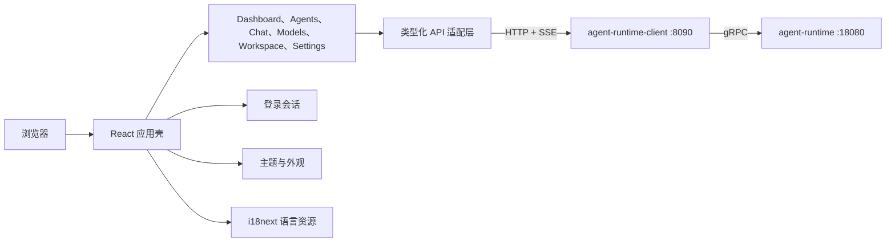

# Athena Agent UI

[English](README.md) | [简体中文](README.zh-CN.md)

Athena Agent UI 是 Athena Agent 平台的浏览器界面。它连接 [`agent-runtime-client`](https://github.com/good-fish-man/agent-runtime-client)，在一个应用中提供 Agent 创建、模型管理、聊天、项目修改、知识库、Skills、语音交互、监控和服务配置。

## 核心能力

- 用户注册/登录、个人资料、头像和管理员视图。
- 展示 Agent、任务/Token、最近会话和审批的 Dashboard。
- Agent 创建器支持 LLM、Embedding、图片模型、Skills、Tools、知识库、记忆、沙箱和 Sub-Agents。
- 按 Agent 隔离聊天历史，支持流式文本、工具事件、生成媒体、审批和语音输入/输出。
- 模型 Key 管理、云端/本地模型、本地下载、生命周期控制、微调与蒸馏。
- 项目目录导入、文件树/搜索、自然语言整体优化、补丁预览、单文件 Diff 和补丁应用。
- Skills、知识库、渠道、Inbox 和命令中心。
- Client、Runtime 与 Skills 配置、状态检查和受控服务重启。
- 用户可切换语言、主题色、页面背景和卡片颜色。
- 桌面端和移动端响应式布局。

## 架构



| 模块 | 位置 |
| --- | --- |
| 应用壳与导航 | `src/App.tsx`、`src/components/Sidebar.tsx` |
| 功能页面 | `src/components/` |
| API 映射与 SSE | `src/lib/api.ts` |
| 登录认证 | `src/lib/auth.ts`、`src/components/AuthScreen.tsx` |
| 国际化 | `src/i18n.ts` |
| 主题持久化 | `src/lib/theme.ts` |
| 公共领域类型 | `src/types.ts` |

## 环境要求

- Node.js 20 或更高版本。
- npm 10 或更高版本。
- Agent Runtime Client，默认位于 `http://localhost:8090`。
- 完整功能还需要 Client 后面的 Agent Runtime 与 PostgreSQL。

普通用户建议通过 [`athena-launcher`](https://github.com/good-fish-man/athena-launcher) 安装完整环境。

## 快速开始

```bash
git clone https://github.com/good-fish-man/athena-agent-ui.git
cd athena-agent-ui
npm install
cp .env.example .env.local
npm run dev
```

打开 [http://localhost:3000](http://localhost:3000)。

后端默认创建的开发管理员账号和密码都是 `athena`。如果不只在可信本机环境中使用，请立即修改密码。

不要通过 `file://` 双击打开 `index.html`。Vite 构建使用 ES Module 和浏览器路由，必须通过 `npm run dev`、`npm run preview`、Nginx 或 Athena Launcher 以 HTTP 方式提供页面。

## 环境变量

`.env.example` 包含前端支持的配置：

```dotenv
VITE_AGENT_RUNTIME_CLIENT_URL="http://localhost:8090"
VITE_AGENT_RUNTIME_PUBLIC_PREFIX="/api/agent-runtime-client/v1"
VITE_AGENT_RUNTIME_API_PREFIX="/v1"
```

| 变量 | 用途 |
| --- | --- |
| `VITE_AGENT_RUNTIME_CLIENT_URL` | Agent Runtime Client 地址 |
| `VITE_AGENT_RUNTIME_PUBLIC_PREFIX` | 需要认证的管理 API 前缀 |
| `VITE_AGENT_RUNTIME_API_PREFIX` | Runtime 执行 API 前缀 |
| `GEMINI_API_KEY` | 可选 Google AI Studio 集成，正常使用后端模型时不需要 |

模型供应商 Key 应在 **Models > Model Keys** 中配置，由后端保存，并且不会在 Agent/模型列表接口中返回给浏览器。

## 使用说明

### 第一次使用

1. 注册或登录。
2. 打开 **Models** 添加模型 Key；不需要 Key 的本地供应商可跳过。
3. 从模型目录创建模型，或下载支持的免费本地模型。
4. 打开 **Agents** 创建 Agent，并主动绑定 LLM、Embedding 或图片模型。
5. 打开 **Chat** 选择 Agent 后开始对话。

Agent 未绑定模型时，Client 会尝试使用当前用户的默认 LLM。公共 Agent 始终使用当前用户自己的模型凭据。

### 项目工作区

1. 打开 **Workspace**，选择或输入项目目录。
2. 导入工作区并查看文件树。
3. 描述项目级修改，不要求必须选中某个文件。
4. 生成补丁，按文件查看添加/删除内容，校验后再应用。

工作区操作发生在运行 `agent-runtime-client` 的机器上，请勿把本地目录接口暴露到不可信网络。

### 外观与语言

在 **Settings** 中切换中文/英文，并调整主色、页面背景和卡片颜色。设置会全局生效并保存在浏览器中。

## 开发

```bash
npm run dev       # 在 3000 端口启动 Vite
npm run lint      # TypeScript 类型检查
npm run build     # 构建到 dist/
npm run preview   # 预览生产构建
```

CI 中建议使用 `npm ci`，严格按照 `package-lock.json` 安装依赖。

## 容器构建

```bash
docker build -t athena-agent-ui .
docker run --rm -p 3000:3000 athena-agent-ui
```

镜像通过 Nginx 提供 `dist/`。请确保浏览器能够访问配置的 Agent Runtime Client，或根据部署环境修改 Nginx 的 `/api` 代理。

## 常见问题

- 双击文件后空白：必须通过 HTTP 提供页面，不能使用 `file://`。
- 登录或网络失败：检查 8090 端口、`VITE_AGENT_RUNTIME_CLIENT_URL`、CORS 和 Client 健康状态。
- 聊天提示绑定模型：为当前用户添加模型/Key，或设置默认模型。
- 本地模型无法安装：启动 Ollama 等本地运行时，或使用 Athena Launcher。
- 切换语言后仍有未翻译文字：对应组件仍缺少 i18n key；新增文字都应进入语言资源层。

## 相关项目

- [`agent-runtime`](https://github.com/good-fish-man/agent-runtime)：执行引擎。
- [`agent-runtime-client`](https://github.com/good-fish-man/agent-runtime-client)：公共 API 与控制面。
- [`athena-launcher`](https://github.com/good-fish-man/athena-launcher)：桌面安装器与服务管理器。

## 许可证

公开分发前请为仓库补充许可证。源码文件中的独立许可证声明仍按对应声明执行。
